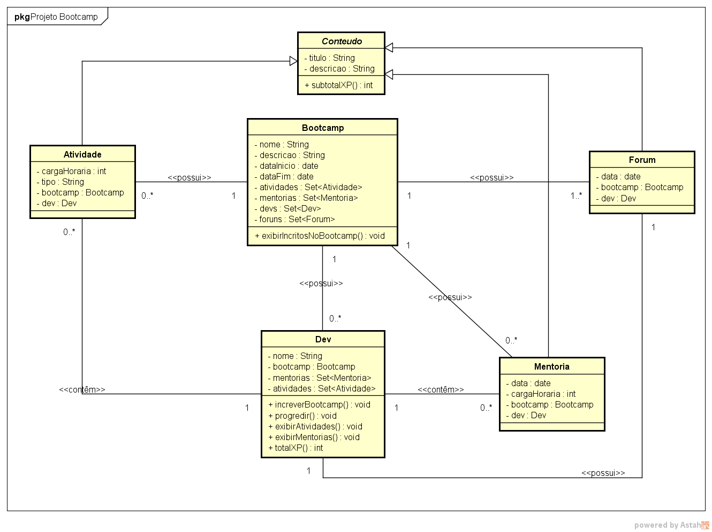
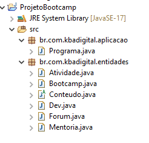

# GFT Start #3 Java
## Projeto Bootcamp
##### Java

#### Programa desenvolvido através de um modelo UML feito por mim, para auxílio na modelagem da entidade de negócio.

#### Programa desenvolvido com dados estáticos que relaciona todos os modelos e exibe o resultado para o usuário.

#### O programa foi feito na IDE Eclipse e foi organizado em pacotes de acordo com suas finalidades:

1. Pacote 1 - aplicação
2. Pacote 2 - entidades

